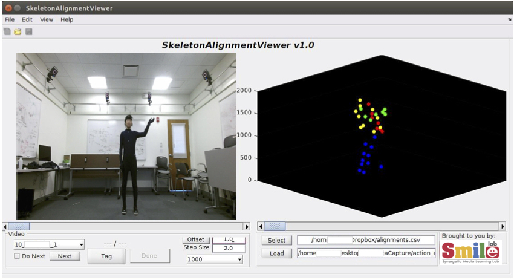

# smile-mocap
## Overview
Source code for MATLAB GUI used to generate ground-truth labels motion capture data. In all, labeling this data consists of a 2-step process: (1) annotating the RGB data that was captured by the Kinect sensor with action tags, and (2) aligning the data clips captured by the Kinect sensor and Vicon system such that the correct action labels propagate across the different modalities.

[Data Project Page](https://github.com/wanglichenxj/EV-Action-Electromyography-Vision-Multi-Modal-Action-Dataset)

## Action Class Annotator

The MATLAB tool (GUI) was designed to facilitate the action labeling process. As shown, the tool displays a video for the human labeler to work choose the start and end frame of an action type from a pre-defined list of actions (used for both individual and human-object actions, with modes toggled via radio-button). Actions are listed in the same order as performed by the different subject performing the action sequences in our data. However, this may vary depending on the data intended to be labeled. Once a video loads, the tool allows the labeler to step frame-by-frame to mark the starting and ending frames of each action, such as *Walking* or *Boxing. The work-flow allows for a quick labeling procedure with minimal human input (i.e., only 2 clicks per action) while providing a feature that continuously scrolls from beginning-to-end of video at 90 fps. Once an action is marked, its assigned color via LUT is filled in on the progress bar below the video display (i.e., position wrt frames position in the video). This visual aid shows the progress, and the labels added. Additionally, it serves as a visual aid for missing or extra labels. Upon completing the video, the tool loads the next sample that does not have corresponding labels.

## Data Alignment

With the data captured by the Kinect sensor labeled according to the action taking place at a given frame, the next goal is to align this data with the corresponding clip that was captured by the Vicon system. Thus, the labels get propagated across the different modalities. Thus, minimizing the manual labor needed for labeling by labeling only one time for each of the 3 modalities (i.e., propagates to EMG data, as captured in sync with Vicon skeleton data). To align the sequential data captured by the 2 different devices, while taking into consideration that the precision of the frame-steps taken by the Kinect sensor, single frames of the RGB and the skeleton data captured by Kinect and the Vicon system, respectfully, are aligned visually. Then, labels are propagated ahead according to the Vicon specifications of 100 fps and the time-stamps of the Kinect sensor, which, combined, allow for accurate measurement (i.e., adequately aligned). A MATLAB GUI to align is also included (screenshot shown in the figure above).

